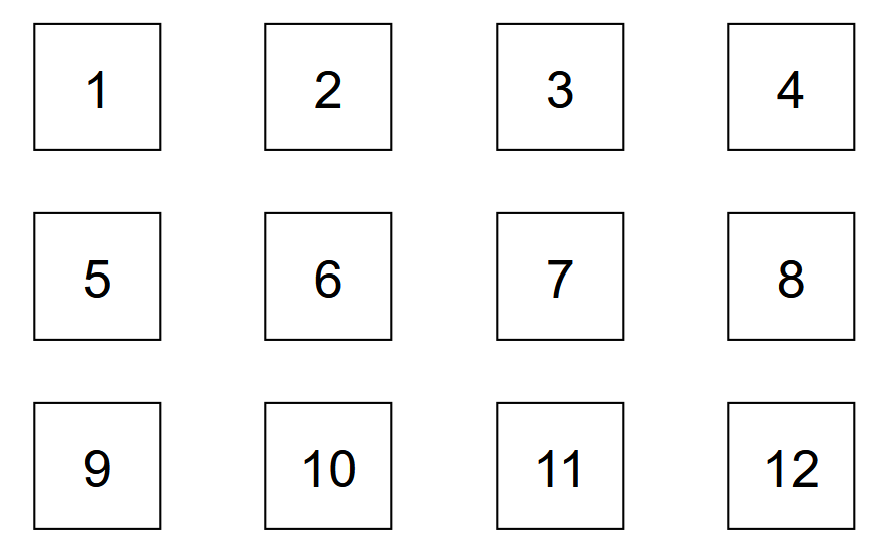

# Dataset Overview

**Author:** Francesco Bianchin  
**Date:** February 2025

This dataset was collected as part of the study presented in _"Bianchin F., et al, Human-Centered Geodesics for Motion Planning, in Proceedings of the International Conference On Rehabilitation Robotics (ICORR) 2025."_ It includes motion trajectory data recorded during human movement experiments using the NESM-γ exoskeleton.

## Experimental Setup

The experiment involved subjects performing predefined motion sequences while interacting with a target board consisting of twelve fixed targets. Target (3) was aligned with the robotic shoulder’s center of rotation. Only the right arm was used, as it was dominant for all subjects. The mirrored kinematic structure of the upper limbs ensures the generalizability of the collected data.

The exoskeleton used in the experiment has a kinematic structure that allows for the measurement of four degrees of freedom (DoF) in the arm. The dataset thus provides precise joint trajectory data capturing the natural movement patterns of the subjects while executing the predefined tasks.

The selected tasks involve predefined motion sequences designed to explore various joint coordination patterns in 3D space. A distinction is made between tasks, which consist of structured sets of movements, and individual motions, which correspond to specific trajectory segments between two postures (i.e., a task typically comprises multiple motions). Task segmentation was implemented to facilitate repetition. Our evaluation focuses on individual motions (Motions 1–30), as these exhibit distinct acceleration and deceleration phases while targeting specific 3D workspace objectives.

**The selected tasks are as follows:**

- **Task 1 (Motions 1–6):** Target reaching and diagonal planar motions  
  R → (1) → (12) → R → (4) → (9) → R

- **Task 2 (Motions 7–12):** Target reaching and top-bottom, left-right motions  
  R → (2) → (10) → R → (9) → (11) → R

- **Task 3 (Motions 13–18):** Bottom-up and right-left planar motions  
  R → (10) → (2) → R → (11) → (9) → R

- **Task 4 (Motions 19–26):** Pointing at board targets  
  R → (1) → R → (3) → R → (9) → R → (11) → R

- **Task 5 (Motions 27–28):** "Drinking" motion  
  K → M → R

- **Task 6 (Motions 29–30):** Shoulder touch  
  K → S → K

<figure>
  
  <figcaption>Figure 1. Experimental setup: A subject performing free-motion tasks using a target board while wearing the NESM-γ exoskeleton in transparent mode. </figcaption>
</figure>

\_

<figure>
  
  <figcaption>Figure 2. Target board used during tasks. </figcaption>
</figure>

## Dataset Structure

The dataset is organized into the following directories:

- **raw_data**: Contains the unprocessed motion data collected during experiments. Each subject's data is stored in an `S0i` folder as a binary file, which can be read using the MATLAB script `LabviewDataOpen.m`.

- **processed_data**: Contains trajectory data that has been segmented and cleaned according to the structure outlined in the referenced study. Idle time has been removed, and motion segments have been extracted for analysis.

## Usage Guidelines

- If full experimental trials are needed, refer to the **raw_data** folder and use the provided MATLAB script for reading.

- If already-segmented motion data is required, refer to the **processed_data** folder.
